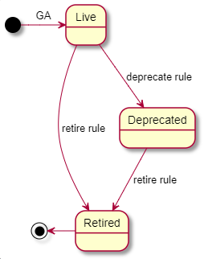

#  REST API Design Guidelines

## Introduction

This repository provides guidelines and examples for APIs at Acronis. These guidelines intend to encourage consistency, maintainability, and best practices across all APIs and applications.

The guidelines are for RESTful APIs. These guidelines are created after reviewing Acronis de-facto standards, [Google API Design](https://cloud.google.com/apis/design/), [PayPal API](https://github.com/paypal/api-standards), [Microsoft REST API Guidelines](https://github.com/Microsoft/api-guidelines/blob/vNext/Guidelines.md), and [Groupe PSA API Design Guidelines](https://github.com/GroupePSA/api-standards/blob/master/api-style-guide.md).

This guide is documented using [github flavored markdown language](https://github.github.com/gfm/#what-is-github-flavored-markdown-)

We encourage everyone at Acronis to follow these new guidelines closely. In case there are variations please contact your project Architect or mail to [Team-RND-Architecture](mailto:Team-RND-Architecture@acronis.com)

## Document Semantics, Formatting, and Naming

The key words "MUST", "MUST NOT", "REQUIRED", "SHALL", "SHALL NOT", "SHOULD", "SHOULD NOT", "RECOMMENDED", "MAY", and "OPTIONAL" in this document are to be interpreted as described in [RFC2119](https://www.ietf.org/rfc/rfc2119.txt).

## Document Version

Document version: **`1.0`**

| Version | Change log                                                   |
| ------- | ------------------------------------------------------------ |
| `1.0`   | Initial release of API Design and Guideline. This has few TBDs which will get updated in subsequent release version. |

# <a name=Standardization>Standardization Overview</a>

This section provides quick overview of enforced policies, RECOMMENDED approaches and areas which were discussed but left for API designers to chose from. 

**Please note :**

1. <a name=Strict>**Strictly follow**</a> policies which needs to be followed.

2. <a name=Recommended>**Recommended**</a> policies can be overridden with valid business requirement.

3. <a name=Informational>**Informational**  </a> policies can be completely overridden as per API designers choice. It could be related to preferred usage pattern or driven by business requirement. 

Please contact [Team-RND-Architecture](mailto:Team-RND-Architecture@acronis.com) in case of doubts. 

The details for each topic can be referred in rest of the document.

| Topic                     | Description                                                  | Acronis stand | Guideline                                                    | Reference                                                    |
| ------------------------- | ------------------------------------------------------------ | ------------- | ------------------------------------------------------------ | ------------------------------------------------------------ |
| RAML                      | API Definition.                                              | Strict        | Needs to be available in [RAML repo](https://git.acronis.com/projects/RAML). The [common repo](https://git.acronis.com/projects/RAML/repos/common/browse) should be considered for Common elements | [RAML](#raml)                                                |
| HTTP Methods              | Usage of different HTTP methods for defining REST APIs.      | Strict        | * Methods - POST, GET, PUT, PATCH, DELETE, OPTIONS<BR>* Idempotency for all HTTP Methods<BR>* Safety for GET and OPTIONS | [HTTP Methods](#http-methods) & <BR>[HTTP Method, Idempotency, Safety and Status code mapping](#http-method,-idempotency,-safety-and-status-code-mapping) |
| HTTP Headers              | Usage of http headers to convey information in request and response. | Strict        | Please refer section                                         | [HTTP headers](#http-headers)                                |
| URI Structure             | Defines the generic URI syntax and a process for    resolving URI references that might be in relative form. | Strict        | HTTPS based URIs. Follow RFC3986                             | [URI Structure](#uri-structure)                              |
| URI Naming Rules          | What is considered as acceptable URI name.                   | Strict        | * plural form of collection of resources, <BR>* singular form for singleton resource<BR>only in English<BR>* formatted using snake_case<BR>* UTF-8 encoded characters only | [URI Naming Rules](#uri-naming-rules)                        |
| URI Parameters            | Different parameters applicable and how to define those.     | Strict        | * Path parameters for specific resource or collection <BR>* Query Parameters for filtering, sorting, selection, view | [URI Parameters](#uri-parameters)                            |
| Resource naming           | REST APIs are modeled (mostly) around resources. This section helps you provide guideline on naming resources.<BR>It considers naming singular as well as collection of resources. | Strict        | * Noun for singular resources,<BR>* Sub-resources under singular resources<BR>* Noun in plural form for collections | [Resource naming](#resource-naming)                          |
| Custom methods            | Functionality that cannot be modeled using resource name. This are considered in **exception** case. | Strict        | In form of `name:customVerb` with applicable HTTP verbs (mostly used with POST HTTP verb) | [Custom methods](#custom-methods)                            |
| Payload - JSON            | Request and response body used to pass information.          | Strict        | * JSON preferred as defined in [RFC 7159](https://tools.ietf.org/html/rfc7159)<BR>* content type should be  `application/json`<BR>* keys formatted in snake_case<BR>* keys must use generic terms<BR>* Country code - [ISO 3166-1 alpha-2](http://www.iso.org/iso/country_codes.htm)<BR>* Currency code - [ISO 4217](http://www.currency-iso.org/)<BR>* Language - [BCP-47](https://tools.ietf.org/html/bcp47)<BR>* Date & Time - [RFC 3339](https://www.ietf.org/rfc/rfc3339.txt)<BR>* Timezone - [TZ database](https://www.iana.org/time-zones) | [JSON Types](#json-types)                                    |
| Error Format              | Error format structure.                                      | Strict        | * 4xx client-side error<BR>* 5xx server-side error<BR>* Please refer section for error schema<BR>* Don't return internal_code, file_path, stack_trace | [Error Format](#error-format)                                |
| Version Management        | API versioning.                                              | Strict        | * API Versions - Live, Deprecated and Retired<BR>* Backward compatibility<BR>* Change management | [Version Management](#version-management)                    |
| Documentation             | API documentation.                                           | Strict        | RAML based                                                   | [Documentation](#documentation)                              |
| API Design first approach | Design APIs before starting code for functionality.          | Recommended   | Design APIs in RAML                                          | [Design first vs Code first approach for APIs](#design-first-vs-code-first-approach-for-apis) |
| Status Codes              | Used as return code from REST APIs.                          | Recommended   | Please refer section                                         | [Status codes](#status-codes)                                |
| Pagination                | Pattern to handle large dataset transfer over wire.          | Recommended   | * Cursor-based<BR>* Offset-based                             | [Pagination](#pagination)                                    |
| Localization              | APIs which have to support multiple locales and langauges.   | Recommended   | API to provide localized messages `api/localization?lang=<langcode>`<BR>langcode should follow [ISO639-1](https://en.wikipedia.org/wiki/ISO_639-1) two-letter codes | [Localization (L10N)](#localization)                         |
| API Security              | Security aspects associated to APIs.                         | Recommended   | Security related to Pagination, URI, Control access to response headers, Webhooks, Cookie, CORS, Tenant validation | [Security](#security)                                        |
| Common patterns           | Various architecture patterns which have impact on API design. | Recommended   | Long running processes, Listing sub-collection, Singleton resource, Throttling, Quotas, Limits, Pagination | [Common Patterns](#common-patterns)                          |
| Asynchronous Operations   | Long running operations may be required to support asynchronous behavior. | Recommended   | * Webhooks<BR>* Polling                                      | [Asynchronous Operations](#asynchronous-operations)          |
| Caching                   | Caching of resources on client side.                         | Informational | Please refer section                                         | [Caching](#caching)                                          |
| Handling Multiple Formats | Applicable when API serve more than one content type.        | Informational | Please refer section                                         | [Handling Multiple Formats](#handling-multiple-formats)      |
| HAL                       | Hyperlink between resources in an API.                       | Informational | Please refer section                                         | [HAL](#hal)                                                  |

# Contract Description

## <a name=raml>RAML</a>

<div style="text-align: right"><b>Acronis stand: <a href=#Strict><span style="color:red">Strictly follow</span></a></b></div>

The [RAML Version 1.0](https://github.com/raml-org/raml-spec/blob/master/versions/raml-10/raml-10.md/) is a language for the definition of HTTP-based APIs that embody most or all of the principles of Representational State Transfer (REST). All REST APIs at Acronis MUST be defined using this format. As it is both human and machine readable, RAML is the essential link between any unit involved in an API's lifecycle, starting from business & technical specifications, to deployment.

As shown in the [official documentation](https://github.com/raml-org/raml-spec), a sample RAML specification written in YAML, looks like this :

```yaml
#%RAML 1.0
title: GitHub API
version: v3
baseUri: https://api.github.com
/user:
  description: The currently authenticated User
/users:
  description: All users
  /{userId}:
   description: A specific user
   uriParameters:
     userId:
       description: The id of the user
       type: integer
```

### <a name=design-first-vs-code-first-approach-for-apis>Design first vs Code first approach for APIs</a>

<div style="text-align: right"><b>Acronis stand: <a href=#Recommended><span style="color:blue">Recommended</span></a></b></div>

At Acronis we do not force any specific approach "design first" or "code first", though Architecture team recommend to use "design first" approach to define APIs. It is RECOMMENDED to provide API described in RAML annotation for the automatization needs. This RAML would be the basics for creating documentation, verifying an annotation to follow Acronis best practices and testing it against the implementation. 

While most of tooling relies on swagger (OAS2.0) for automatization, RAML is considered more powerful for design needs. 

**Please note**: There will be tooling made available to convert from RAML to Swagger for further processing if required. **TBD: link to repo/ADN**

All the RAML files should be captured at <https://git.acronis.com/projects/RAML> under appropriate component section. It is RECOMMENDED to make use of *(and contribute)* RAML for common patterns defined at <https://git.acronis.com/projects/RAML/repos/common/browse>.

## <a name=http-methods>HTTP methods</a>

<div style="text-align: right"><b>Acronis stand: <a href=#Strict><span style="color:red">Strictly follow</span></a></b></div>

HTTP defines a set of request methods to indicate the desired action to be performed for a given resource. The primary or most-commonly-used HTTP verbs (or methods) are  `POST`, `GET`, `PUT`, `PATCH` and `DELETE`. There are a number of other verbs, too, but not encouraged for defining APIs. Please contact  [Team-RND-Architecture](mailto:Team-RND-Architecture@acronis.com) if there is a need to use other HTTP verbs outside of below table. HTTP defines a set of request methods to indicate the desired action to be performed for a given resource. The primary or most-commonly-used HTTP verbs (or methods) are  `POST`, `GET`, `PUT`, `PATCH` and `DELETE`. There are a number of other verbs, too, but not encouraged for defining APIs. Please contact  [Team-RND-Architecture](mailto:Team-RND-Architecture@acronis.com) if there is a need to use other HTTP verbs outside of below table. See also [Custom methods](#custom-methods)

|  Method   | Action/Description                                  |
|-----------|---------------------------------------------------------------------------------------------------|
|  `POST`   | Method requests the server to **create** a resource in the system. In exception case, can be used to **update** resource (e.g. Client has resource id but unaware if resource exists. Client can use `POST` to create when resource doesn't exist or updates the resource if exists). |
|  `GET`  | Method **requests data** from the resource and SHOULD NOT produce any side effect (change to resource state) |
|  `PUT`  | Method requests the server to **update** resource |
|  `PATCH`  | Method requests the server to **partially update** resource                     |
|  `DELETE` | Method requests that the resources, or its instance, **should be removed** from the system |

On some occasions you may need to support `OPTIONS` HTTP verb.

| Method    | Action/Description                                           |
| --------- | ------------------------------------------------------------ |
| `OPTIONS` | Method is used to describe the communication options for the target resource. `OPTIONS` allows a client to retrieve information about a resource, at a minimum by returning the `Allow` header denoting the valid methods for this resource. This method allows the client to determine the options and/or requirements associated with a resource, or the capabilities of a server/service, without implying a resource action or initiating a resource retrieval. In [CORS](https://developer.mozilla.org/en-US/docs/Web/HTTP/CORS), a preflight request with the `OPTIONS` method is sent, so that server can respond whether it is acceptable to send the request with these parameters. |

The actual operation invoked MUST match the HTTP method semantics as defined in the table above.

## Idempotent & Safe

<div style="text-align: right"><b>Acronis stand: <a href=#Informational><span style="color:blue">Informational</span></a></b></div>

### <a name=idempotency>Idempotency</a>

Idempotency is an important aspect of building a fault-tolerant API. Idempotent APIs enable clients to safely retry an operation without worrying about the side-effects that the operation can cause. For example, a client can safely **retry** an idempotent request in the event of a request failing due to a network connection error. More information as defined in RFC 7231 can be found [here](https://tools.ietf.org/html/rfc7231#section-4.2.2).

Per [HTTP Specification](https://tools.ietf.org/html/rfc2616#section-9.1.2), a method is idempotent if the side-effects of more than one identical requests are the same as those for a single request. It is NOT mandatory for server to send same response code to client in case client makes same request multiple times.

Methods `GET`, `HEAD`, `PUT` and `DELETE` are defined idempotent.

**Example** - The following statement is **idempotent** : no matter how many times this statement is executed, the archive's retention will always be set to 20 days.

```json
archive.retention = 20 // idempotent
```

**Example** -  The following statement is **not idempotent** : executing this 10 times will result in different outcomes.

```json
archive.retention += 1 // non-idempotent
```

Please refer [HTTP Method, Idempotency, Safety and Status Code Mapping](#http-method,-idempotency,-safety-and-status-code-mapping) on recommendation for your APIs.

### <a name=safe>Safe</a>

Per [HTTP Semantics and Content](https://tools.ietf.org/html/rfc7231#page-22) request methods are considered "**safe**" if their defined semantics are essentially read-only; i.e., the client does not request, and does not expect, any state change on the origin server as a result of applying a safe method to a target resource.  Likewise, reasonable use of a safe method is not expected to cause any harm, loss of property, or unusual burden on the origin server.

Safe methods are HTTP methods that do not modify resources. Meaning safe HTTP method MUST NOT create, update or delete resources. In addition, safe methods can be cached and prefetched without any repercussions to the resource.

**Example** - The following request is **incorrect** if this request actually deletes the resource : `GET` methods SHALL NOT produce any side effect (change to resource state)

```http
GET https://dev.cloud.acronis.com/api/platform/v1/backups/9812763:delete HTTP/1.1
```

Please refer [HTTP Method, Idempotency, Safety and Status Code Mapping](#http-method,-idempotency,-safety-and-status-code-mapping) on recommendation for your APIs.

## <a name=status-codes>Status codes</a>

<div style="text-align: right"><b>Acronis stand: <a href=#Recommended><span style="color:blue">Recommended</span></a></b></div>

Per [RF7231](https://www.ietf.org/rfc/rfc2616.txt), the Status-Code element is a 3-digit integer result code of the attempt to understand and satisfy the request.

### Status Codes Ranges

The first digit of the Status-Code defines the class of response. The last two digits do not have any categorization role. There are 5 values for the first digit:

- `1xx`: Informational - Request received, continuing process
- `2xx`: Success - The action was successfully received, understood, and accepted
- `3xx`: Redirection - Further action MUST be taken in order to complete the request
- `4xx`: Client Error - The request contains bad syntax or cannot be fulfilled
- `5xx`: Server Error - The server failed to fulfill an apparently valid request. (**note** : Service developers MUST avoiding to return `5xx` codes if it was received from other consuming service)

### Status Codes List

It is RECOMMENDED that APIs only return commonly used status codes listed in the table below. APIs MAY return a status code that is **not defined** in this table, in which case API designers MUST clearly state the reasons behind this choice.

#### Commonly used status codes

| Status Code | Description | Examples |
|-------------|-------------|-------------|
| `200 OK` | Standard response for successful HTTP requests. The actual response will depend on the request method used. In a GET request, the response will contain an entity corresponding to the requested resource. In a POST request the response will contain an entity describing or containing the result of the action. |  |
| `201 Created` | The request has been fulfilled and resulted in a new resource being created. Successful creation occurred (via either POST or PUT). Set the Location header to contain a link to the newly-created resource (on POST). Response body content may or may not be present. |  |
| `202 Accepted` | Used for asynchronous method execution to specify the server has accepted the request and will execute it at a later time. For more details, please refer [Asynchronous Operations](#asynchronous-operations). | Asynchronous task posted in Task Manager |
| `204 No Content` |  The server successfully processed the request, but is not returning any content. The 204 response MUST NOT include a message-body, and thus is always terminated by the first empty line after the header fields. | Search service accepts open index request |
| `304 Not Modified` | Used for conditional GET calls to reduce band-width usage. If used, MUST set the Date, Content-Location, ETag headers to what they would have been on a regular GET call. There MUST be no body on the response. **TBD:** https://pmc.acronis.com/browse/ASDK-226 | account-server: when etag field with valid value is not provided by the client |
| `400 Bad Request` | The request could not be understood by the server due to malformed syntax. The client SHOULD NOT repeat the request without modifications. | ATP Downloader - PUT /settings_pack when invalid settings_pack |
| `401 Unauthorized` | The request requires authentication and none was provided or the provided one is invalid and authentication should be tried again. Note the difference between this and `403 Forbidden`.| This can be thrown in case client requests using expired or bad tokens |
| `403 Forbidden` | The server understood the request, but is refusing to fulfill it. It SHOULD describe the reason for the refusal in the entity. If the server does not wish to make this information available to the client, the status code 404 (Not Found) can be used instead | Archive Server Core - archive password required while accessing password protected archive |
| `404 Not Found` | Used when the requested resource is not found, whether it doesn't exist or if there was a 401 or 403 that, for security reasons, the service wants to mask |  |
| `409 Conflict` | Request conflict with current state of the server. Conflicts are most likely to occur in response to a [`PUT`](https://developer.mozilla.org/en-US/docs/Web/HTTP/Methods/PUT) request. | Backup Manager - backup name conflict |
| `415 Unsupported Media Type` | The server MUST return this status code when the media type of the request's payload cannot be processed. For example, if the client sends a `Content-Type: application/xml` header, but the API can only accept `application/json`, the server MUST return `415`. |  |
| `500 Internal Server Error` | This is either a system or application error, and generally indicates that although the client appeared to provide a correct request, something unexpected has gone wrong on the server. A `500` response indicates a server-side software defect or site outage. `500` SHOULD NOT be utilized for client validation or logic error handling. |  |


## <a name=http-method,-idempotency,-safety-and-status-code-mapping>HTTP Method, Idempotency, Safety and Status code mapping</a>

<div style="text-align: right"><b>Acronis stand: <a href=#Strict><span style="color:red">Strictly follow</span></a></b></div>

- `GET`: The purpose of the `GET` method is to retrieve a resource. On success, a status code `200` and a response with the content of the resource is expected. Resource can be a collection or singular resource or no resource. In cases where resource collections are empty (0 items in `/archives`), `200` is the appropriate status (resource will contain an empty `items` array). `204` SHALL NOT be used even though there is no content.
  - MUST NOT create any side-effect ([Safe](#safe))
  - More than one identical requests MUST have the same behavior ([idempotent](#idempotency))
- `POST`: The primary purpose of `POST` is to create a resource. If the resource did not exist and was created as part of the execution, then a status code `201` SHOULD be returned.
  - It is expected that on a successful execution, a reference to the resource created (in the form of a link or resource identifier or entire resource object) is returned in the response body.
  - Idempotency semantics: If this is a subsequent execution of the same invocation and the resource was already created, then a status code of `200` SHOULD be returned. **TBD: ** (using ETags or client request identifier) https://pmc.acronis.com/browse/ASDK-226 and **TBD:** <https://pmc.acronis.com/browse/ASDK-224>
  - MAY create side-effect (not safe)
- `PUT`: It is used for full update of resource or collection. This method in most cases return status code `204` as there is no need to return any content. The information from the request should not be echoed back. 
  - MAY create side-effects (not safe)
  - Idempotency semantics: More than one identical requests MUST have the same behavior.
  - MAY return the resource link or resource identifier or entire resource object.
- `PATCH`: It is used for partial update of a resource or collection. This method SHOULD follow the same status/response semantics as `PUT`, `204` status and no response body.
  - `200` response body with complete resource should be avoided at all costs, as `PATCH` performs partial updates, meaning multiple calls per resource is normal. As such, responding with the entire resource can result in large bandwidth usage, especially for bandwidth-sensitive mobile clients.
  - MAY return the resource link or resource identifier
  - MAY create side-effect (not safe)
- `DELETE`: This method is RECOMMENDED to return status code `204` as there is no need to return any content in most cases as the request is to delete a resource and it was successfully deleted.
  - As the `DELETE` method MUST be idempotent as well, it SHOULD still return `204`, even if the resource was already deleted. Usually the API consumer does not care if the resource was deleted as part of this operation, or before. This is also the reason why `204` instead of `404` should be returned.
  - MAY create side-effects (not safe)
  - More than one identical requests MUST have the same behavior (idempotent)
- `OPTIONS`: This method SHOULD return 200 with any header fields  that indicate optional features implemented by the server and applicable to that resource. 

### Summary

For each HTTP method, API developers SHOULD use only status codes marked as "X"  in this table. 

| Status Code | Idem-potent | Safe | 200 Success | 201 Created |202 Accepted | 204 No Content | 400 Bad Request | 401 Unauthorized | 403 Forbidden|  404 Not Found |500 Internal Server Error |
|-------------|:---------------|:----------------|:----------------|:----------------|:---------------|:------------------------|-------------|-------------|-------------|-------------|-------------|
| `GET`       | <div style="text-align: center">**Yes**</div> | <div style="text-align: center">**Yes**</div> | <div style="text-align: center"> X</div> |             |             |                | <div style="text-align: center"> X</div> | <div style="text-align: center"> X</div> | <div style="text-align: center"> X</div> | <div style="text-align: center"> X</div> | <div style="text-align: center"> X</div> |
| `POST`      | <div style="text-align: center">**Yes**</div> | <div style="text-align: center">No</div> | <div style="text-align: center"> X</div> | <div style="text-align: center"> X</div> |  | <div style="text-align: center"> X</div> | <div style="text-align: center"> X</div> | <div style="text-align: center"> X</div> | <div style="text-align: center"> X</div> | <div style="text-align: center"> X</div> | <div style="text-align: center"> X</div> |
| `PUT`       | <div style="text-align: center">**Yes**</div> | <div style="text-align: center">No</div> | <div style="text-align: center"> X</div> |               | <div style="text-align: center"> X</div> | <div style="text-align: center"> X</div> | <div style="text-align: center"> X</div> | <div style="text-align: center"> X</div> | <div style="text-align: center"> X</div> | <div style="text-align: center"> X</div> | <div style="text-align: center"> X</div> |
| `PATCH`     | <div style="text-align: center">**Yes**</div> | <div style="text-align: center">No</div> | <div style="text-align: center"> X</div> |               |               | <div style="text-align: center"> X</div> | <div style="text-align: center"> X</div> | <div style="text-align: center"> X</div> | <div style="text-align: center"> X</div> | <div style="text-align: center"> X</div> | <div style="text-align: center"> X</div> |
| `DELETE`    | <div style="text-align: center">**Yes**</div> | <div style="text-align: center">No</div> | <div style="text-align: center"> X</div> |               |               | <div style="text-align: center"> X</div> | <div style="text-align: center"> X</div> | <div style="text-align: center"> X</div> | <div style="text-align: center"> X</div> | <div style="text-align: center"> X</div> | <div style="text-align: center"> X</div> |
| `OPTIONS` | <div style="text-align: center">**Yes**</div> | <div style="text-align: center">**Yes**</div> | <div style="text-align: center"> X</div> | | |  |  | |  |  |  |

Example on making POST idempotent - TBD: <https://pmc.acronis.com/browse/ASDK-224>

Recommendation on creating and updating multiple resources - TBD: <https://pmc.acronis.com/browse/ASDK-309>

**Please note**:

1. Resource creation should be done via `POST`.
2. Avoid usage of `HEAD` HTTP method. The `OPTIONS` usage is also limited.
3. <a name=upsert>Upsert (portmanteau of *update* and *insert*) semantics</a> on `PATCH` or `PUT` are NOT RECOMMENDED. 
4. Resource update to existing resources is RECOMMENDED via `PUT` or `PATCH`. In certain cases, as deemed necessary by service implementers `POST` can also be used to update existing resources.
5. Please take approval from [Team-RND-Architecture](mailto:Team-RND-Architecture@acronis.com) team in case of doubts.

## <a name=http-headers>HTTP headers</a>

<div style="text-align: right"><b>Acronis stand: <a href=#Strict><span style="color:red">Strictly follow</span></b></a></div>

HTTP Headers allow the client and the server to pass additional information with the request or the response. An HTTP header consists of its **case-insensitive** name followed by a colon '`:`', then by its value (without line breaks). Leading white space before the value is ignored.

HTTP headers are written in PascalCase + hyphenated syntax, e.g. `Foo-Request-Id`.

All header values MUST follow the syntax rules set forth in the specification where the header field is defined. Many HTTP headers are defined in [RFC7231](https://tools.ietf.org/html/rfc7231), however a complete list of approved headers can be found in the [IANA Header Registry](http://www.iana.org/assignments/message-headers/message-headers.xhtml)."

HTTP Headers can be grouped according to their contexts

* **General header**: Headers applying to both requests and responses but with no relation to the data eventually transmitted in the body.
* **Request header**: Headers containing more information about the resource to be fetched or about the client itself.
* **Response header**: Headers with additional information about the response, like its location or about the server itself (name and version etc.)
* **Entity header**: Headers containing more information about the body of the entity, like its entity length or its MIME-type.

HTTP Headers can also be grouped according to how proxies handle them:

* **End-to-end headers**: These headers MUST be transmitted to the final recipient of the message; that is, the server for a request or the client for a response. Intermediate proxies MUST retransmit end-to-end headers unmodified and caches MUST store them.
* **Hop-by-hop headers**: These headers are meaningful only for a single transport-level connection and MUST not be retransmitted by proxies or cached. Such headers are: `Connection`, `Keep-Alive`, `Proxy-Authenticate`, `Proxy-Authorization`, `Transfer-Encoding`.

**Please Note**:

1. Service Consumers and Service Providers:
   * SHOULD NOT expect that a particular HTTP Header is available.
   * SHOULD NOT assume the value of a header has not been changed as part of HTTP message transmission.
2. Intermediate servers (For example Web-services framework, API Gateway, Authorization handler, Load Balancers etc.)
   * MAY add, remove, or change a value of an HTTP header.
   * MAY return an error based on availability and validity of a particular header without transmitting the message forward. For example, API Gateway MAY forward HTTP request with only `Authorization` HTTP header without other headers or message body to Authorization module for authorizing the request.

### Standard request headers

The table of request headers below SHOULD be used by Acronis services.

All header values MUST follow the syntax rules set forth in the specification where the header field is defined. Many HTTP headers are defined in [RFC7231](https://tools.ietf.org/html/rfc7231), however a complete list of approved headers can be found in the [IANA Header Registry](http://www.iana.org/assignments/message-headers/message-headers.xhtml)."

| Header                                                       | Type                                                         | Description                                                  |
| ------------------------------------------------------------ | ------------------------------------------------------------ | ------------------------------------------------------------ |
| [Authorization](https://tools.ietf.org/html/rfc7235#section-4.2) | String                                                       | Authorization header for the request. For authorization scheme please get approvals from Security Architecture team (contact [Andon Dedov](mailto:Anton.Dedov@acronis.com)) |
| [Accept](https://tools.ietf.org/html/rfc7231#section-5.3.2)  | Content type                                                 | Applicable for services which support multiple data formats. The requested content type for the response such as:application/xmltext/xmlapplication/jsontext/javascript (for JSONP)Per the HTTP guidelines, this is just a hint and responses MAY have a different content type, such as a blob fetch where a successful response will just be the blob stream as the payload. For services following OData, the preference order specified in OData SHOULD be followed. API documentation should clearly document supported content types. |
| [Accept-Encoding](https://tools.ietf.org/html/rfc7231#section-5.3.4) | *Upto service implementors*                                  | REST endpoints SHOULD support encoding, when applicable. For very large resources, services MAY ignore and return uncompressed data. For example, GZIP and DEFLATE. |
| [Content-Type](https://tools.ietf.org/html/rfc7231#section-3.1.1.5) | Content type                                                 | Mime content type. For example, `application/json` for JSON Mime, `application/xml` for XML Mime |
| [Content-Length](https://tools.ietf.org/html/rfc7230#section-3.3.2) | Decimal number of octets                                     | For effective Input Output, it is highly desired to have it in request and response. When a message does not have a Transfer-Encoding header field, a `Content-Length` header field can provide the anticipated size, as a decimal number of octets, for a potential payload body.  For messages that do include a payload body, the Content-Length field-value    provides the framing information necessary for determining where the body (and message) ends. |
| [Host](https://tools.ietf.org/html/rfc7230#page-44)          | uri-host [ ":" port ]                                        | The "Host" header field in a request provides the host and port information from the target URI, enabling the origin server to distinguish among resources while servicing requests for multiple host names on a single IP address. |
| [User-Agent](https://tools.ietf.org/html/rfc7231#section-5.5.3) | product *( RWS ( product / comment ) ),  product         = token ["/" product-version]      product-version = token | The "User-Agent" header field contains information about the user agent originating the request, which is often used by servers to help identify the scope of reported interoperability problems, to work around or tailor responses to avoid particular user agent limitations, and for analytics regarding browser or operating system use. The header can be used for some custom service logic or for custom requests routing. |

### Standard response headers

The table of response headers below SHOULD be used by Acronis services.

These may not be applicable in all the responses, hence API documentation should clearly document ones implemented by the service and any client side operation is mandated.

| Header                                                       | Type                        | Description                                                  |
| ------------------------------------------------------------ | --------------------------- | ------------------------------------------------------------ |
| [Content-Encoding](https://tools.ietf.org/html/rfc7231#section-3.1.2.2) | *Upto service implementors* | It should be same as request. Content-Encoding is primarily used to allow a representation's data to be compressed without losing the identity of its underlying media type. For example, GZIP. |
| [Content-Type](https://tools.ietf.org/html/rfc7231#section-3.1.1.5) | Content type                | It should be one of selected from request. Mime content type. For example, `application/json` for JSON Mime |
| [Content-Length](https://tools.ietf.org/html/rfc7230#section-3.3.2) | Decimal number of octets    | For effective Input Output, it is highly desired to have it in request and response. When a message does not have a Transfer-Encoding header field, a `Content-Length` header field can provide the anticipated size, as a decimal number of octets, for a potential payload body.  For messages that do include a payload body, the Content-Length field-value provides the framing information necessary for determining where the body (and message) ends. |
| [Location](https://tools.ietf.org/html/rfc7231#section-7.1.2) | URI-reference               | The "Location" header field is used in some responses to refer to a specific resource in relation to the response. It can be used by service implementers for 3xx requests (redirection) or on resource creation (201) |

### Custom HTTP headers

Acronis RECOMMEND `X-` prefix convention for Сustom Headers. While this convention was deprecated in June 2012, the cause of deprecation doesn't affect Acronis.The cause was in [inconveniences it led to when non-standard fields](https://tools.ietf.org/html/rfc6648#appendix-B) became standard in [RFC 6648](https://tools.ietf.org/html/rfc6648)

Acronis RECOMMEND use Custom Headers not parameters when common processing in some middlewares is / worth possible.
Thus any service using Custom Headers SHOULD assume that any header may become standardized, public, commonly deployed,or usable across multiple implementations.

At the same time implementations of application protocols MUST NOT make any assumptions about the status of a parameter, nor take automatic action regarding a parameter, based solely on the presence or absence of '`X-`' or a similar construct in the parameter's name.

In Acronis there is no standard headers used by all services. Some services, working with exising APIGW, may use its [headers](https://adn.acronis.com/display/ALAB/API+Gateway) like `X-Apigw-Session-ID`, `X-Apigw-Session-Login`, etc

# Naming Conventions

Naming conventions for URIs, query parameters, resources, fields and enums are described in this section. It also provides RECOMMENDATIONs on various usage of query parameters. These guidelines are about defining some naming conventions and sticking to them in a consistent manner while designing APIs.

Naming policies should aid developers in discovering functionality without constantly refer to documentation. Use of common patterns and standard conventions greatly aid developers in correctly guessing common property names and meanings.

## URI

### <a name=uri-structure>URI Structure</a>

<div style="text-align: right"><b>Acronis stand: <a href=#Strict><span style="color:red">Strictly follow</span></a></b></div>

Acronis follows [RFC3986](http://tools.ietf.org/html/rfc3986) for URI definition.

**Example** : API called `platform` under the `cloud.arconis.com` domain. This specific endpoint addresses `v1` of the API and accesses the resource collection `archives` (filtering by `id=de61sjuK`)

```http
  https://cloud.acronis.com/api/platform/v1/archives?id=de61sjuK
  \___/  \____________________/ \______/\_/ \_______/ \_______/
    |             |                |     |       |        |
 protocol      domain        namespace version resources query
            environment    or resource                 parameters
                               group
```

APIs at Acronis MUST be be formatted with the following components : 

- **protocol** : MUST always be `https`
- **environment** : could be `prod` for production, `preprod` preproduction or `dev` development
- **api** : specifies that this specific URI is an API endpoint
- **domain** : specific to Acronis, can include a sub domain
- **namespace** or **resource group** : Is logical grouping of application, data and its metadata. Examples - **platform**, **ipn** (for global instance), **notary** (for global instance)
- **version** : MUST only contain the major version (`v1` instead of `v1.0`). Versions are associated with namespace and grow independent of each other. For example, released platform APIs may be at 1.0 while notary APIs may be at 2.0.
- **resources** : Resources exposed via REST API
- **query parameters** : (Optional) depending upon API Endpoint means either data filtering, pagination.

### <a name=uri-naming-rules>URI Naming Rules</a>

<div style="text-align: right"><b>Acronis stand: <a href=#Strict><span style="color:red">Strictly follow</span></a></b></div>

All API URIs MUST follow the rules listed below :

1. MUST avoid having actions or verbs. Allowed only in rare cases as defined in [Custom methods](#custom-methods)
2. MUST contain the plural form of collection of resources
3. MUST contain the singular form for singleton resource
4. MUST use the English language
5. HTTP methods SHALL define the kind of action to be performed on the resource
6. MUST be formatted using lower snake_case
7. MUST only contain [UTF-8](https://en.wikipedia.org/wiki/UTF-8#Codepage_layout) encoded characters

#### Bad way of naming URIs

Let’s consider an **Archive** resource on which we would like to perform several actions such as `list`, `update`, and `delete` . The API could be defined in a way that each endpoints corresponds to an operation as follows :

- `GET `**`/getArchives`** : **return** all archives
- `GET `**`/deleteArchive`** : **delete** archive (using `GET` here because we are not sending any data)
- `GET `**`/encryptArchive`** : **encrypt** archive (using `GET` here because we are not sending any data)
- `POST `**`/createArchive`** : **create** archive according to the request **body**
- `POST `**`/updateArchive`** : **update** archive according to the request **body**
- `POST `**`/expireArchive`** : **expire** archive according to the request **body**

**What is wrong with this implementation ?**

- The API endpoint MUST avoid having actions or verbs in names. URIs MUST contain the plural form of resources and the HTTP method should define the kind of action to be performed on the resource.
- There will be as many endpoints as there are operations to perform and many of these endpoints will contain redundant actions. This leads to unmaintainable APIs.

#### Good way of naming URIs

If verbs cannot be used in URIs, how can endpoints tell the server about the actions to be performed on a given resource ? This is where the HTTP methods (or verbs as seen before) play the role. Let's consider the same example following REST rules :

- **`GET`**`/archives` : **return** all archives
- **`GET`**`/archives/1fde` : **return** archive with id `1fde`
- **`POST`**`/archives`: **create** archive according to the request `body`
- **`DELETE`**`/archives/1fde` : **delete** archive with id `1fde`
- **`PUT`**`/archives/1fde` : **update** archive with id `1fde`
- **`GET`**`/backupplans/123/archives/1fde` : **return** archive with id `1fde` in backup plans with id  `123` (if we have a resource under a resource)

Great, but how do we encrypt (or perform any other specific service using REST)? This is where things get tricky in REST. Since we cannot use verbs in URIs and there is no HTTP method to encrypt an archive, then how do we do it?

There are multiple ways of working around this, choose the one that makes sense to you and to your application. Ask yourself what the `encrypt` operation does: does it update a field in the archive object? Does it create a new record? Does it update some kind of resource associated to the archive? Once you have defined the behavior, you can either:

1. RESTful way : `PATCH /archives/1fde` which will partially update the archive object to reflect encryption on an archive (given that your models are built this way)
2. RESTful way: `PATCH /archives/1fde/indexes/abcd` which will partially update archive associated resource called `indexes/abcd` and reflect encryption on it.
3. Non-RESTful way though it is clean : `POST /archives/456/encrypt` this contains a verb and isn't considered RESTful though it is semantically clean and explicit.

As a rule of thumb, anytime a service (as opposed to a resource) has to be exposed, APIs MAY expose the result as a resource.

**What is better with this implementation ?**

APIs are more precise and consistent. They are easier to understand both for humans and machines and thus maintainable.

### <a name=uri-parameters>URI Parameters</a>

<div style="text-align: right"><b>Acronis stand: <a href=#Strict><span style="color:red">Strictly follow</span></a></b></div>

#### Path Parameters

`/archives/{id}` : variable parts of a URI path, typically used to point to a specific resource within a collection. Each path parameter MUST be substituted with an actual value when the client makes an API call.

**Example** : `GET /archives/1ddfe` used to target a specific archive resource with ID `1ddfe`

#### Query Parameters

`/archives?name=value` : appear at the end of the request URI after a question mark (`?`) separated by ampersands (`&`). Be careful when using sensitive/private query parameters as the URI because:

* Are often logged by default by server components (proxy, server, gateways)
* Are often sent as `referer` headers
* Browsers also log and store URIs.

Hence be careful, **Sensitive information** and **[Personal identifiable Information (PII)](https://en.wikipedia.org/wiki/Personal_data)** SHOULD NOT be transmitted in the URL. **HEADERS** instead should be considered to pass such information.

**Example** : `GET /archives?name=1ddf*` used to target archives with name starting with `1ddf`

**Header Parameters **

`X-MyHeader : Value` : an API call may require that custom headers be sent with an HTTP request. Some sample headers are `Content-Type`, `Accept`, `Authorization` etc.

**Example** : `curl /archives/ddf3a -H "Content-Type: application/json"` used to retrieve archive`ddf3a` in `JSON` format

##### Filter a resource collection

* Query parameters SHOULD be used only for the purpose of restricting the resource collection or as search or filtering criteria.
* Parameters for pagination SHOULD follow [pagination](#pagination) guidelines.
* Default sort order SHOULD be considered as undefined and non-deterministic. If a explicit sort order is desired, the query parameter `sort` SHOULD be used with the following general syntax: `{field_name}|{asc|desc},{field_name}|{asc|desc}`. For instance: `/accounts?sort=date_of_birth|asc,zip_code|desc` 

**TBD** update below table based on https://pmc.acronis.com/browse/ASDK-223

**Filter on a single resource**

Query parameters SHOULD NOT be used in cases to filter on single resource as it doesn't make sense. 

**TBD** to update below table based on https://pmc.acronis.com/browse/ASDK-223 

##### Sorting

**TBD** to update below table based on https://pmc.acronis.com/browse/ASDK-223

Server/Service can provide requested resources in un-sorted or default sort order. Clients should be able to override this behavior by sending sort query parameters. 

##### Views, Filters, Sorting, and Selection

**TBD** to update below table based on https://pmc.acronis.com/browse/ASDK-223

| Operation                                        | Description                                                  | Recommended methodology |
| ------------------------------------------------ | ------------------------------------------------------------ | ----------------------- |
| Filtering (AND)                                  | Clients to filter a collection of resources URL using multiple filter parameters over **AND** condition |                         |
| Filtering (OR)                                   | Clients to filter a collection of resources URL using multiple filter parameters over **OR** condition |                         |
| Sorting                                          | Server/Service can provide requested resources in un-sorted or default sort order. Clients should be able to override this behavior by sending sort query parameters.. Clients can override the default sort order for resources in the collection |                         |
| Selecting or Field Selection or Partial Response | Clients to fetch partial information about requested resource. Selecting fields allows consumers to only fetch data they need within a resource. This mechanism is really useful when dealing with bad internet connection |                         |
| Repeated query parameters                        | Filter by multiple values for same parameter <br>`s=6&s=8`   |                         |
| Resource View                                    | To reduce network traffic, it is sometimes useful to allow the client to limit which parts of the resource the server should return in its responses, returning a view of the resource instead of the full resource representation. |                         |
| ETag                                             | An ETag is an opaque identifier allowing a client to make conditional requests. **TBD ** update based on https://pmc.acronis.com/browse/ASDK-226 |                         |
| Time selection                                   | Allow clients to select a subset of items based on time range |                         |

##### Not RECOMMENDED with Query Parameters

Below table highlights few areas which are not RECOMMENDED and SHOULD BE avoided. However in case of exceptions, please check with [Team-RND-Architecture](mailto:Team-RND-Architecture@acronis.com) team.

| DONTs                                                        | Alternatives                                                 |
| ------------------------------------------------------------ | ------------------------------------------------------------ |
| Sensitive information                                        | As HTTP Header in case of GET or DELETE HTTP Method. As body when its POST, PATCH or PUT Method |
| Personal Identifiable Information (PII)                      | As HTTP Header in case of GET or DELETE HTTP Method. As body when its POST, PATCH or PUT Method |
| Filter on single resource URI                                | `GET` with resource URI SHOULD BE used.                      |
| Using Query parameters in POST, PUT, PATCH Method            | As body when its POST, PATCH or PUT Method                   |
| URI including Query parameters more than [2000](https://stackoverflow.com/questions/417142/what-is-the-maximum-length-of-a-url-in-different-browsers#417184) characters | Restrict long query parameter name                           |
| Plural names                                                 | Use singular names e.g. `?status=CLOSED`                     |
| Comma separated values                                       | Use repeatable parameters e.g. `?status=CLOSED&status=INVALID` |
| Resource identifier in a collection                          | Resource identifier should be in the URI                     |

## <a name=resource-naming>Resource naming</a>

<div style="text-align: right"><b>Acronis stand: <a href=#Strict><span style="color:red">Strictly follow</span></a></b></div>

In resource-oriented APIs, *resources* are named entities, and *resource names* are their identifiers. Each resource MUST have its own unique resource name. The resource name is made up of the ID of the resource itself, the IDs of any parent resources, and its API service name.

There are 2 categories of resources

1. Singular Resources
2. Collection of Resources

The resource name is organized hierarchically using collection IDs and resource IDs, separated by forward slashes. If a resource contains a sub-resource, the sub-resource's name is formed by specifying the parent resource name followed by the sub-resource's ID - again, separated by forward slashes.

These are special kind of resources that contains list of sub-resources of identical types. For example, a directory is a collection of file resources. The resource ID for a collection is called collection ID.

**Example:** `storage.acronis.com` service has a collection of `vaults`, where each `vault` has a collection of `archives`:

| API Service Name              | Collection ID | Resource ID | Collection ID | Resource ID   |
| ----------------------------- | ------------- | ----------- | ------------- | ------------- |
| `https://storage.acronis.com` | `/vaults`     | `/vault-id` | `/archives`   | `/archive-id` |

### Singular Resources

Developers MUST follow these principles for Singular Resources:

* **Nouns** MUST be used, not verbs
* Resource names MUST be **singular for singletons**

e.g. `object-id`, `index-id` etc.

#### Sub-resources

Sub-resource collections MAY exist directly beneath an individual resource. This should convey a relationship to another collection of resources. (archive-indexes, in this example)

```HTTP
archives/{archive-id}/indexes
```

Sub-resource individual resources MAY exist, but should be avoided in favor of top-level resources.

#### Full Resource Name

A scheme-less [URI](http://tools.ietf.org/html/rfc3986) consisting of a [DNS-compatible](http://tools.ietf.org/html/rfc1035) API service name and a resource path. The resource path is also known as *relative resource name*. For example:

```HTTP
https://cloud.acronis.com/archives/archive1/indexes/index2
```

The API service name is for clients to locate the API service endpoint; it **may** be a fake DNS name for internal-only services. If the API service name is obvious from the context, relative resource names are often used.

#### Relative Resource Name

A URI path ([path-noscheme](http://tools.ietf.org/html/rfc3986#appendix-A)) without the leading "/". It identifies a resource within the API service. For example:

```HTTP
/archives/archive1/indexes/index2
```

### Collection of Resources

Developers MUST follow these principles for modeling resource collection:

* **Nouns** MUST be used, not verbs
* Collection names MUST be **plural**

e.g. `objects`, `archives`, `indexes` etc.

## <a name=standard-fields>Standard fields</a>

This section describes a set of standard message field definitions that should be used when similar concepts are needed. This will ensure the same concept has the same name and semantics across different APIs.

| Name        | Type        |  Description                                                          |
| ----------- | ----------- | --------------------------------------------------------------------- |
| id          | string      | Object unique id                                                      |
| tenant_id   | string      | Tenant id                                                             |
| name        | string      | The name field should contain the relative resource name.             |
| create_time | timestamp   | The creation timestamp of an entity.                                  |
| update_time | timestamp   | The last update timestamp of an entity. Note: update_time is updated when create/patch/delete operation is performed.                                |
| expire_time | timestamp   | The expiration timestamp of an entity if it happens to expire.        |
| display_name| string      | The display name of an entity.                                        |
| show_deleted| bool        |If a resource allows undelete behavior, the corresponding List method must have a show_deleted field so client can discover the deleted resources. |

## <a name=custom-methods>Custom methods</a>

<div style="text-align: right"><b>Acronis stand: <a href=#Strict><span style="color:red">Strictly follow</b></a><i> when required</i></span></div>

This section is inspired from [Google's API Guideline](https://cloud.google.com/apis/design/custom_methods).

Custom methods refer to API methods besides the 5 standard methods. By default they are not allowed. They SHOULD only be used for functionality that cannot be easily expressed via standard methods. In general, API designers SHOULD choose standard methods over custom methods whenever feasible. Standard Methods have simpler and well-defined semantics that most developers are familiar with, so they are easier to use and less error prone. Another advantage of standard methods is the API platform has better understanding and support for standard methods, such as billing, error handling, logging, monitoring.

A custom method can be associated with a resource, a collection, or a service. It **may** take an arbitrary request and return an arbitrary response, and also supports streaming request and response.

Custom methods MUST follow [method naming convention](#resource-naming).

### HTTP mapping

For custom methods, they SHOULD use the following generic HTTP mapping:

```HTtp
https://service.acronis.com/v1/some/resource/name:customVerb
```

The reason to use `:` instead of `/` to separate the custom verb from the resource name is to support arbitrary paths. For example, to import many hosts in the system from a file below API can be considered

```http
POST /environment/hosts:import
```

The following guideline SHALL be applied when choosing the HTTP mapping.

* Custom methods SHOULD USE `POST` HTTP method by default.
* Custom methods SHOULD BE [idempotent](#idempotency) and cause no side effects (change to resource state).
* The URL MUST end with suffix consisting of a colon followed by *custom verb*.

### Scenarios for custom methods

This section provides some common cases where custom methods can be used.

| Method name | Custom Verb | HTTP verb       | Note                                                         |
| ----------- | ----------- | --------------- | ------------------------------------------------------------ |
| Cancel      | `:cancel`   | `POST`          | Cancel an outstanding operation (ongoing backup, computation, etc) |
| Move        | `:move`     | `POST`          | Move a resource from one parent to another parent            |
| Login       | `:login`    | `POST`          | Initiate login request                                       |
| Logout      | `:logout`   | `POST`          | Logout request                                               |
| Search      | `:search`   | `GET` or `POST` | Search for some data in the system                           |

Please contact Architecture team if you have special cases to consider.

## <a name=pagination>Pagination</a>

<div style="text-align: right"><b>Acronis stand: <a href=#Recommended><span style="color:blue">Recommended</a></span></b></div>

When the dataset is too large, well designed APIs divide the data set into smaller chunks, which helps in improving the performance and makes it easy for the consumer to handle the response.

List-able collections SHOULD support pagination even if results are typically small.

**Rationale:** If an API does not support pagination from the start, supporting it later is troublesome because adding pagination breaks the API's behavior. Clients that are unaware that the API now uses pagination could incorrectly assume that they received a complete result, when in fact they only received the first page.

There are two most common approaches to implement pagination: cursor-based and offset-based. Offset-bases approach is simpler for implementation, while cursor-based is better over unstable collections. You may choose either of them can be considered as per business case.

### <a name=cursor>Cursor-based pagination</a>

**Cursors** let you specify the exact position in the list you want to begin with, as well as the number of items you want to fetch specified using the `limit` parameter (should be set by default). This technique SHOULD be considered by default.

Cursors MUST satisfy all the characteristics listed below by the resources in question:

- **Unique** : if not unique, conflicts may occur while setting the starting point of the pagination
- **Sortable** : to insure consistency and allow sorting
- **Stateless** : if not stateless, a cursor might not be available by the time it is used

The ideal cursor is an **encoded timestamp** of the item or its **incremental ID**.

For request, consider `pageable` trait defined in [`common\traits\pageable.raml`](https://git.acronis.com/projects/RAML/repos/common/browse/traits/pageable.raml)

For response, service should consider to return cursors and SHOULD consider to return `total` number of records available in the system and `count` of records included in the response.

```YML
types:
  cursor:
    description: Specific location in some collection.
    type: string
  cursors:
    description: Cursors before and after the current page, with # of records.
    type: object
    properties:
      before?: cursor
      after: cursor
      count?: number of records included in the response
      total?: total number of records in the collection based on filter query

traits:
  pageable:
    queryParameters:
      limit?:
        type: integer
        description: Number of element in the page
      before?:
        type: cursor
        description: Cursor before the current page
      after?:
        type: cursor
        description: Cursor after the current page
  
```

**Example**: cursor based pagination in query parameter of request

```http
GET /resource_manager/v1/o365/groups/eb8977ec/resources?after=eyfQ&limit=3
```

```JSON
{
   "items":[
      {
         "id":"4f146cc3-a357-1519d3a",
         "name":"Conf Room Crystal",
         "email":"Cry@M365x952275.oosoft.com",
         "tenant":{
            "id":"3",
            "name":"crayfish",
            "locator":"/1/3/"
         },
         "mailboxId":"69673-b3e5087ef66e"
      },
      {
         "id":"f759fca8-0b62-1519d3b",
         "name":"Com Rainier",
         "email":"Rainr@M365x952275.oosoft.com",
         "tenant":{
            "id":"3",
            "name":"crayfish",
            "locator":"/1/3/"
         },
         "mailboxId":"3dad8c8a-b3e5087ef66r"
      },
      {
         "id":"88a2b044-ed5b-4724-8e07-6f771ec77a18",
         "name":"G Archie",
         "email":"GryA@M365x952275.oosoft.com",
         "tenant":{
            "id":"3",
            "name":"crayfish",
            "locator":"/1/3/"
         },
         "mailboxId":"b59d18a4-21ae094b6c26"
      }
   ],
   "paging":{
      "cursors":{
          "before":"eyJSJdfQ",
          "after" : "yfdKSNa#",
          "count" : 3,
          "total" : 200
      }
   }
}
```

### Offset-based pagination

**This pagination technique SHOULD NOT be considered as first choice. **

In this technique API consumer will have to specify :

- An `offset` (or `from` or `page`): the start position of the concerned list of data
- A `limit`: the number of items to be retrieved. A default limit MUST be set.

Service implementer will skip records *before* `offset` x `limit` and return subsequent records restricted by `limit` parameter.

#### Advantages of offsets

1. Easy to provide pages to the API consumer with less strain on the system resources compared to other      options.
2. API consumer can navigate back and forth in the pages.
3. API consumer can jump freely across pages.

#### Disadvantages of offsets

1. These are not performant with large datasets since application has to scan through all the record sets till requested page/offset.
2. In some occasions, server/service implementer may have to cache the records before returning the results. In such cases, dynamic updates will not reflect in the result set and also it needs more resources.

As a reference point, search project uses Offset based pagination provided by Elasticsearch.

## Summary

| Section                                         | Standard / Recommended                                       | Example                                                      |
| ----------------------------------------------- | ------------------------------------------------------------ | ------------------------------------------------------------ |
| URL Path case                                   | snake_case                                                   | `/archive_indexes`                                           |
| URI Structure                                   | `/api/{namespace | resource_group}/v{major_v}`               | `https://cloud.acronis.com/api/platform/v1/archives?id=de61sjuK` |
| Resource naming                                 | Plural for collections, singular for singleton               | `/indexes/o365_email_456789091`                              |
| Verb/action in resource name                    | NOT RECOMMENDED. <BR>Allowed **only** in rare cases (Please refer [Custom methods](#custom-methods)) | MUST NOT <span style="color:red"> `/get_details` </span>     |
| Resource renaming / move                        | Using `PUT /resource` with property change (new parent ID)   |                                                              |
| Resource name exceptions                        | Avoid characters `%` & `-`                                   | MUST NOT <span style="color:red"> `/email%` </span>or<span style="color:red"> `o365-email-4567`</span> |
| Query parameters naming                         | The name SHOULD be same as in JSON response                  |                                                              |
| Standard fields (common field definition names) | Use common names and types for common fields [Standard Fields](#standard-fields) |                                                              |
| Enum naming                                     | UPPER_CASE, underscore                                       | `FOO_BAR_UNSPECIFIED`, `DISCONNECTED`                        |
| JSON field naming                               | MUST be snake_case                                           | MUST `o365_email_8546988` but NOT <span style="color:red"> `O365Email456`</span> |
| Pagination technique                            | Recommended is Cursor based                                  | `GET /resource_manager/v1/o365/resources?after=eyfQ&limit=3` |

# Payload

<div style="text-align: right"><b>Acronis stand: <a href=#Strict><span style="color:red">Strictly follow</a></span></b></div>

It is assumed throughout these guidelines that request bodies and response bodies MUST be sent using [JavaScript Object Notation (JSON)](http://json.org/). JSON is a light-weight data representation for an object composed of unordered key-value pairs. JSON can represent four primitive types (strings, numbers, booleans, and null) and two structured types (objects and arrays). 

When processing an API method call, the following guidelines SHOULD be followed.

Kindly contact Architecture team in case you want to use other than JSON.

## General JSON Guidelines

<div style="text-align: right"><b>Acronis stand: <a href=#Strict><span style="color:red">Strictly follow</a></span></b></div>

### Data model

The data model for representation MUST conform to the JSON Data Interchange Format as described in [RFC 7159](https://tools.ietf.org/html/rfc7159).

### Serialization

- Resource endpoints MUST support `application/json` as content type.
- If an `Accept` header is sent and `application/json` is not an acceptable response, a `406 Not Acceptable` error MUST be returned.

### JSON Object Key

A JSON key or attribute MUST :
* Be unique for any given level of data
* Use consistent case for keys : JSON keys MUST be formatted using snake_case
* Respect the informational context by using clear and explicit naming : keys MUST use generic terms reusable in a different context than the application it was first designed for.

- **Bad - Non-unique keys at the root of the object**

  ```json
  "index" : {
    "id": 19083974,
    "name": "o365_mail_75674",
    "name": "o365_mail_77666",  // Bad : using name twice on the same level of data is forbidden
} 
  ```
- **Good - Unique keys at any given level of data**

  ```json
  "index" : {
        "id": 19083974,
        "name": "o365_mail_75674",
        "versions": {
          "slice_range": "[1,8]", // Good:  this is allowed since it belongs to versions and not index
          "location": "/archive/1/f/abc"
        }
  } 
  ```

- **Bad - Non generic naming**

  ```json
    "vault" : {
        "vault_id": 19083974, // Bad : since a vault could be a different object in a different context
        "SL" : {       // Bad : not developer friendly as it could mean Storage Location or something else and other projects might call it differently
          "location":"/usr/storage/data1/vault"
        }
    } 
  ```

- **Good - Generic naming**

  ```json
    "vault" : {
        "id": 19083974,   // Good: generic naming, can be used in any context
        "location": {      // Good : generic naming
          "name": "/usr/storage/data1/vault", // Good : better naming strategy
        }
    } 
  ```

## <a name=json-types>JSON Types</a>

<div style="text-align: right"><b>Acronis stand: <a href=#Strict><span style="color:red">Strictly follow</a></span></b></div>

This section provides guidelines related to usage of [JSON primitive types](#json-primitive-types) as well as [commonly useful JSON types](#common-types) for address, name, currency, money, country, phone, among other things. APIs MUST follow common formatting rules to insure consistency across all projects.

### <a name=json-primitive-types>JSON Primitive Types</a>

As per [draft-04](https://tools.ietf.org/html/draft-zyp-json-schema-04#section-3.5) JSON Schema defines seven primitive types for JSON values:
* **array** : A JSON array.
* **boolean** : A JSON boolean.
* **integer** : A JSON number without a fraction or exponent part.
* **number** : Any JSON number.  Number includes integer.
* **null** : The JSON null value
* **object** : A JSON object.
* **string** : A JSON string.

#### Null

APIs MUST NOT produce or consume null values. In JSON, a property that doesn't exist or is missing in the object is considered to be `undefined`; this is conceptually separate from a property that is defined with a value of `null`.

For instance, a property `address` defined as `{"type": "null"}` is represented as : 

```json
  "customer" : {
    "id": 19083974,
    "address": "null"
  }
```

While a property `address` that is `undefined` MUST NOT be present in the object :

```json
  "customer" : {
    "id": 19083974
  }
```

### <a name=common-types>Common Types</a>

Resource representations in API MUST reuse the common data type definitions below where possible. Following sections provide some details about some of these common types. 

#### Internationalization (I18N)

The following common types MUST be used with regard to global country, currency, language and locale.

| Type            | Example | Rule |
|-----------------|---------|------|
| Country code | `FR`    | APIs are free to chose formats that suits your business case. However it is RECOMMENDED to use the [ISO 3166-1 alpha-2](http://www.iso.org/iso/country_codes.htm) two letter country code standard. |
| Currency code | `EUR`   | All APIs MUST use the the three letter currency code as defined in [ISO 4217](http://www.currency-iso.org/). For quick reference on currency codes, see [http://en.wikipedia.org/wiki/ISO_4217](http://en.wikipedia.org/wiki/ISO_4217). |
| Language | `fr-FR` | All APIs MUST use the [BCP-47](https://tools.ietf.org/html/bcp47) language tag composed of : the `ISO-639 alpha-2 language code` (Optional), the `ISO-15924` script tag, the `ISO-3166 alpha-2` country code |

For more detailed information on Internalization in general please refer [ADN page](https://adn.acronis.com/display/LOC/Acronis+Code+Internationalization+Guidelines). Please also see [Localization](#localization) section.

#### Date Time Common Types

Recommended approach is to use [RFC 3339](https://www.ietf.org/rfc/rfc3339.txt) and in exception cases [RFC 850](https://tools.ietf.org/html/rfc850) timestamp format.

The following common types to express various date-time formats:

| Type        | RFC                                                          | Example               |
| ----------- | ------------------------------------------------------------ | --------------------- |
| Date & Time | [RFC 3339](https://www.ietf.org/rfc/rfc3339.txt) `date-time` | `2019-02-03T19:31:29` |
| Date        | [RFC 3339](https://www.ietf.org/rfc/rfc3339.txt) `full-date` | `2018-02-06`          |
| Time        | [RFC 3339](https://www.ietf.org/rfc/rfc3339.txt) `full-time` | `19:31:29`            |

#### Timezone

Some services may require using Timezones, for example for describing agent activity on a client side. In those cases we recommend to specify timezone in string format in accordance to [Iana TZ database](https://www.iana.org/time-zones).

### Summary

| JSON Types   | Standard                                                     | Example               |
| ------------ | ------------------------------------------------------------ | --------------------- |
| Country code | APIs are free to chose formats that suits your business case. However it is RECOMMENDED to use the [ISO 3166-1 alpha-2](http://www.iso.org/iso/country_codes.htm) two letter country code standard. | SG for Singapore      |
| Date & Time  | Preferred RFC3339, but accept RFC850 (http time formats) and timestamps | `2019-02-03T19:31:29` |
| Date format  | Preferred RFC3339, but accept RFC850 (http time formats) and timestamps | `2019-02-03`          |
| Time format  | Preferred RFC3339, but accept RFC850 (http time formats) and timestamps | `19:31:29`            |
| Timezone    | It is RECOMMENDED to use [TZ database](https://www.iana.org/time-zones). | SG for Singapore      |

## <a name=caching>Caching</a>

<div style="text-align: right"><b>Acronis stand: <a href=#Informational><span style="color:blue">Informational</a></span></b></div>

The ability to cache and reuse previously fetched resources is a critical aspect of optimizing for performance.  Every browser comes with an implementation of an HTTP cache. Developers MUST ensure that each server response provides the correct HTTP header directives to instruct the browser on when and for how long the browser can cache the response. 

### Caching headers

This table summarizes the most used caching techniques :

| Header                     | Definition                                                   | Acronis standard |
| -------------------------- | ------------------------------------------------------------ | ---------------- |
| `Cache-Control : no-store` | **Disallows the browser and all intermediate caches** from storing any version of the returned response. Every time the user requests this asset, a request is sent to the server and a full response is downloaded. This is equivalent to no caching at all. | Not enforced     |
| `Cache-Control : private`  | Disallows any intermediate cache to cache the response. For instance, a user's browser can cache an HTML page with private user information, but a CDN can't cache the page. | Not enforced     |
| `Cache-Control : max-age`  | Specifies the maximum time in seconds that the fetched response is allowed to be reused from the time of the request. For instance if `Cache-Control : maxe-age=60` header is set, any call made within 60 seconds will get a cached response. | Not enforced     |
| `Last-Modified`            | Contains the date and time at which the origin server believes the resource was last modified. It is used as a validator to determine if a resource received or stored is the same. Must be validated against `If-Modified-Since` & `If-Unmodified-Since` headers. | Not enforced     |
| `Expires`                  | Tells the client when the resource is going to expire. Usually has a date value that specifies from when the resource will be considered stale (possibly out-of-date), and so it needs to be re-validated. For instance if `Expires : Wed, 31 Dec 2018 07:28:00 GMT` header is set, any request made to the server before the specified date will return a cached response. | Not enforced     |
| `Etag`                     | The ETag is a unique identifier for your response: it is used on conditional requests using `If-None-Match` header. *Note*: you have to make sure the server provides a validation token (ETag) service **TBD** update based on https://pmc.acronis.com/browse/ASDK-226 | Recommended      |

### Caching policies

API developers and designers MUST define and configure the appropriate per-resource settings, as well as the overall "caching hierarchy." : try to find a balance between good and bad reactivity depending on the resource type. API designers MUST determine the best cache hierarchy for their API : the combination of resource URLs with content fingerprints (Etag) and short or no-cache lifetimes allows you to control how quickly the client picks up updates.

#### Caching dynamic data

You cannot cache for long periods of time, such as days, hours or sometimes even minutes because data becomes stale too quickly. That doesn't mean, however, that such data shouldn't be cached at all. When caching resources for short periods of time you should be using HTTP caching instructions that do not rely on shared understanding of time, such as `Cache-Control: max-age`, `Expires` and `ETags`

> Dynamic data is data that is often changing includes GPS location, battery voltage, tire pressure etc. 

#### Caching near-static data

If you are caching resources (API responses) for sufficiently long periods of time (hours, days, potentially: months) you usually do not have to worry about the issues related to date-time-based caching. For facilitating caching of near-static data, you could use two approaches:  

- `ETags` that do not rely on shared agreement on time  **TBD:** update based on https://pmc.acronis.com/browse/ASDK-226
- `Last-Modified` : header that is date-time-centric

> Near static data includes country codes, static images like icons, localization labels etc.

#### No cache

You can choose not to cache response, in real-time systems for examples, however this comes with great responsibility. The ability to cache and reuse previously fetched resources is a critical aspect of optimizing for performance. Even for dynamic data, caching can tremendously increase performance.

> Real time data includes car speed, precise GPS location etc. 

### Caching strategy

There's no one best cache strategy. API designers and developers MUST take several parameters into account while working on caching strategy :

- **Type of data served** : as we've seen before, dynamic and static data will not have the same caching policy.
- **Traffic patterns** : caching was designed to optimize performances by limiting server calls - if your API is used be a few consumers, caching might not be as critical as if your API was used by millions of people.
- **Application-specific requirements for data freshness** : caching is application specific, meaning that a resource might not be cached the same way across all applications.
  *example*: a GPS location might not be cached the same way in :  
  - Real-time applications (Waze for instance) : data has ~1sec or less lifetime
  - A car dealership application to know approximately where the car is located : data has a ~1min lifetime

Developers MAY refer to this diagram when deciding on which caching technique to choose :

Image credit [Google's HTTP Caching](https://developers.google.com/web/fundamentals/performance/optimizing-content-efficiency/http-caching) article. 


## <a name=error-format>Error Format</a>

<div style="text-align: right"><b>Acronis stand: <a href=#Strict><span style="color:red">Strictly follow</a></span></b></div>

The HTTP status codes in the `4xx` range indicate client-side errors (validation or logic errors), while those in the `5xx` range indicate server-side errors (usually defect or outage). However, these status codes and human readable reason phrase are not sufficient to convey enough information about an error in a machine-readable manner. To resolve an error, non-human consumers of RESTful APIs need additional help.

### Error Schema

It is required for service implementers to follow the error structure defined in RAML at https://git.acronis.com/projects/RAML/repos/common/browse/schemas/error_v2.raml

RAML defines below fields which MUST be considered by service implementers to return error. Client implementers MUST refer to service API documentation to know exact error fields and meaning of values.

* `domain`: A human-readable error type or category. It can be service name as well. e.g. `Licensing`, `Access`, `PolicyManager` etc.

* `code`: Error id or code, unique in the domain. This is same as earlier used (now obsolete) `reason` field in some existing services.

* `message`: *Optional property.* A human-readable message, describing the error. This message MUST be a description of the problem NOT a suggestion about how to fix it.

* `context`: *Optional* *property*. This is defined as an RAML `object`. Service implementers can extend it to have error centric properties. 

  e.g. If service throwing error `ReasonFeatureUnsupported`, then additional property say `search_feature` can be added to `context`. Hence client receives `ReasonFeatureUnsupported` error with more information inside field `context.search_feature`

* `kbLink`: *Optional* *property*. This is defined as an RAML `object` with below properties.

  * `lineTag`: TBD
  * `serCode`: service specific error code
  * `version`: application version
  * `build`: service build number defined as string
  * `product`: Product information
  * `os`: Operating System information

* `debug`: *Optional* *property*. This is defined as an RAML `object`. Service implementers can extend it to have error centric properties. 

An error response MUST NOT include any of the following information :
* Internal code
* File path
* Stack trace

e.g.

```json
{  
   "domain":"Licensing",
   "code":"accessDenied",
   "message": "User access was denied by the system.",
   "context": {  
       "moreinfo": fuzzer
   },
   "kbLink": {
       "lineTag": "TBD",
       "serCode": "150",
       "version": "9.0",
       "build": "master_315_#73",
       "product": "ACC",
       "os": "win10x64v1703"
   },
   "debug" : {
       "validator": "internal v2 validator services"
   }
}
```

## <a name=handling-multiple-formats>Handling Multiple Formats</a>

<div style="text-align: right"><b>Acronis stand: <a href=#Informational><span style="color:blue">Informational</a></span></b></div>

In the case where APIs serve more than one content type, consumers MUST specify type they need using Accept header.

APIs MAY take as input or output any content type needed (an audio file, a specific text format etc.).  Each API endpoint specifies what response type it outputs and what it consumes in cases where it applies:

```HTTP
GET /URL  HTTP/1.1
Accept : text/*
```
```HTTP
HTTP/1.1 200 OK  
Content-Type : text/html
```

See complete list of [MIME Types](https://developer.mozilla.org/fr/docs/Web/HTTP/Basics_of_HTTP/MIME_types/Complete_list_of_MIME_types)

## Hypermedia

<div style="text-align: right"><b>Acronis stand: <a href=#Informational><span style="color:blue">Informational</a></span></b></div>

### HATEOAS

Hypermedia, an extension of the term [hypertext](https://en.wikipedia.org/wiki/Hypertext), is a nonlinear medium of information which includes graphics, audio, video, plain text and hyperlinks according to [wikipedia](https://en.wikipedia.org/wiki/Hypermedia). Hypermedia As The Engine Of Application State (`HATEOAS`) is a constraint of the REST application architecture described by Roy Fielding in his [dissertation](https://www.ics.uci.edu/~fielding/pubs/dissertation/rest_arch_style.htm).

In the context of RESTful APIs, a client could interact with a service entirely through hypermedia provided dynamically by the service. A hypermedia-driven service provides representation of resource(s) to its clients to navigate the API dynamically by including hypermedia links in the responses. 

APIs MAY use hypermedia, though it is not mandatory. APIs using hypermedia MUST however do it using [HAL](#hal).

### <a name=hal>HAL</a>

HAL is a simple format that gives a consistent and easy way to hyperlink between resources in your API. For detailed information on HAL refer [HAL specification](http://stateless.co/hal_specification.html). In short, HAL provides a set of conventions for expressing hyperlinks in either JSON or XML. 

**Please note** : At Acronis, traditionally we have followed variation to existing HAL solution defined in [RAML/common/schemas/link.raml](https://git.acronis.com/projects/RAML/repos/common/browse/schemas/links.raml). 

API designers feel free to use either of methods when it comes to supporting HAL. Please contact [Team-RND-Architecture](mailto:Team-RND-Architecture@acronis.com) in case of doubts.

## <a name=localization>[Localization (L10N)](https://en.wikipedia.org/wiki/Language_localisation)</a>

<div style="text-align: right"><b>Acronis stand: <a href=#Recommended><span style="color:blue">Recommended</a></span></b></div>

If API is going to have localization support API designers SHOULD follow the recommendation below.

1. Provide API that will provide localized data dictionary for requested language as below

   `api/localization?lang=<langcode>`

   where `langcode` should be specified as defined in [ISO639-1](https://en.wikipedia.org/wiki/ISO_639-1) two-letter codes.

   

   e.g. below API will fetch language dictionary for Spanish language

   ```http
   GET https://cloud.acronis.com/platform/v1/localization?lang=es
   ```

2. Localized repository per language SHOULD BE provided. 

3. These repositories 

   * SHOULD have dictionary in name-value pair.
   * SHOULD be created at build-time and shipped with the main service supporting localized messages.
   * SHOULD cover all error codes with messages where error codes will be `name` and respective message will be `value`

4.  All services should by default return codes and values in `en` (English) language.

5. Client application SHOULD fetch required language dictionary, cache it and show corresponding localized messages to end user.

6. All clients and services are mandated to log in `en` (English) language. (MAY additional chose to log in localized language)

Please contact [Team-RND-Architecture](mailto:Team-RND-Architecture@acronis.com) if your use-case needs exception to above process.

**Additional Resources** : [Product per language](https://adn.acronis.com/display/LOC/Product+per+Language) ADN page for languages supported by Acronis products.

### Summary

| Localization                   | Description                                                  | Acronis Standard                                             |
| ------------------------------ | ------------------------------------------------------------ | ------------------------------------------------------------ |
| Dictionary                     | API to retrieve localized message.                           | Request `api/localization?lang=<ISO 639-1 langcode>` and get dictionary |
| `Accept-Language` HTTP header  | Specifies the preferred language for the response. Services are not required to support this, but if a service supports localization it MUST do so through the Accept-Language header. | <span style="color:red">NOT RECOMMENDED</span>               |
| `Content-Language` HTTP header | Used to describe the language(s) intended for the audience, so that it allows a user to differentiate according to the users' own preferred language. For example, if "`Content-Language: de-DE`" is set, it says that the document is intended for German language speakers (however, it doesn't indicate the document is written in German. For example, it might be written in English as part of a language course for German speakers). | <span style="color:red">NOT RECOMMENDED</span>               |

# <a name=asynchronous-operations>Asynchronous Operations</a>

<div style="text-align: right"><b>Acronis stand: <a href=#Recommended><span style="color:blue">Recommended</a></span></b></div>

Certain types of operations might require processing of the request in an asynchronous manner in order to avoid long delays on the client side and prevent long-standing open client connections waiting for the operations to complete. Usually, asynchronism should be considered when a delays exceed 400ms. If that is the case, API designers should ask themselves if such delay is problematic or not.  

## Operation Completion Notification

There exists multiple ways to notify the API consumer that the operation has finished executing :
* **Webhooks** : force the consumer to implement web hooks to retrieve the operation's response. While this solution is ideal and is RECOMMENDED for all APIs, consumer might not always support it.  
* **Polling** : force the consumer to poll until the operation has finished executing

### <a name=webhooks>[Webhooks](https://en.wikipedia.org/wiki/Webhook)</a>

The time it takes for an operation to finish may vary : [Polling](#polling) forces consumers to figure out how often to make the polling calls which is far from being optimal. Instead, it is RECOMMENDED that APIs use webhooks whenever possible.

Webhooks solve this problem by allowing a web service to provide other services with near real-time information using HTTP POST requests. In short: instead of asking the server if it has data, the consumer will be notified to a given URI that the data is available.

Server will provide resource URI details in the callback, so client can then retrieve the requested resources.

```sequence
Client->Server: GET /resources, notify on POST /callback
Server-->Client: 202 request accepted
note right of Server: works on client request
note right of Server: Once results are ready does client callback
Server-->Client: Callback(resource URI details)
Client -->Server: resource URI
Server --> Client: 200 OK with resource data
```

**Please note** : WebHooks technique is used by Scheduler service in Acronis.

It is RECOMMENDED for service implementers using WebHooks technique to document -

1. Define how client callback API look like (this includes HTTP Headers, HTTP method, resource URI and payload)
2. API consumers SHOULD BE able to reach to resource URIs which may be hosted on separate server.
3. Network paths need to be configured for server to invoke API consumer callback.
4. Documentation; ways for API consumers to specify webhook URIs and payload. Below is RECOMMENDED payload structure for webhook

| Attribute   | Type    | Description |
|---------------|---------------|------------------------------------|
| `id`    | `string`    | Unique identifier for the webhook. |
| `created`   | `timestamp`   | Unique identifier for the webhook. |
| `data`  | `url`       | URL to retrieve data associated with the event. |
| `type`  | `string`    | Description of the event (e.g: `car.registered` or `user.created`) |

**Sample webhook payload** 

```json
  {
    "id": "evt_1BqTZj2eZvKYlo2CvwY0ZQBr",
    "created": 1517435823,
    "data":  "https://cloud.acronis.com/api/platform/v1/index/o365_mail_6735",
    "type": "user.created"
  }
```

**API consumers**

API Consumer MUST setup an API endpoint to receive webhook's payloads and returing appropriate status codes. In pseudo code : 
```bash
post "/webhook/url" do
  # Retrieve the request's body and parse it as JSON
  event_json = JSON.parse(request.body.read)

  # Do something with event_json

  status 200
end
```

More information on Registration, Workflow and Authorization **TBD**:<https://pmc.acronis.com/browse/ASDK-311>

### <a name=polling>Polling</a>

Polling technique is used with use cases where 

 cannot be used. It is not highly RECOMMENDED approach, if still there are use cases to use Polling technique then please contact [Team-RND-Architecture](mailto:Team-RND-Architecture@acronis.com).

The APIs MUST employ following pattern using Polling technique -

1. **For `POST` requests :**

* Return the `202 Accepted` HTTP response code.
* In the response body, include one or more URIs as hypermedia links, which could include:
    * The final URI of the resource where it will be available in future if the ID and path are already known. API Consumers can then make an HTTP `GET` request to that URI in order to obtain the completed resource. Until the resource is ready, the final URI SHOULD return the HTTP status code `404 Not Found`. This is equivalent to polling.

        `{ "rel": "self", "href": "/v1/resources/{resource_id}", "method": "GET" }`

    * A temporary request queue URI where the status of the operation may be obtained via some temporary identifier. Clients SHOULD make an HTTP `GET` request to obtain the status of the operation which MAY include such information as completion state, ETA, and final URI once it is completed. This is equivalent to polling.

        `{ "rel": "self", "href": "/v1/requests/{request_id}, "method": "GET" }"`

2. **For `PUT`/`PATCH`/`DELETE`/`GET` requests:**

Like `POST`, you can support `PUT`/`PATCH`/`DELETE`/`GET` to be asynchronous. The behaviour would be as follows:

* Return the `202 Accepted` HTTP response code.
* In the response body, include one or more URIs as hypermedia links, which could include:
  * A temporary request queue URI where the status of the operation may be obtained via some temporary identifier. Clients SHOULD make an HTTP `GET` request to obtain the status of the operation which MAY include such information as completion state, ETA, and final URI once it is completed.
    
    `{ "rel": "self", "href": "/v1/queue/requests/{request_id}, "method": "GET" }"`

3. **APIs that support both synchronous and asynchronous processing for an URI:**

APIs that support both synchronous and asynchronous operations for a particular URI and an HTTP method combination, MUST recognize the `Prefer` header and exhibit following behavior:

* If the request contains a `Prefer=respond-async` header, the service MUST switch the processing to asynchronous mode. 
* If the request doesn't contain a `Prefer=respond-async` header, the service MUST process the request synchronously.

It is desirable that all APIs that implement asynchronous processing, also support [webhooks](#webhooks) as a mechanism of pushing the processing status to the client.

# <a name=security>Security</a>

<div style="text-align: right"><b>Acronis stand: <a href=#Recommended><span style="color:blue">Recommended</a></span></b></div>

Security is critical part of an API hence API implementers should follow guidelines published at [TBD: Security Guide](). This guide will provide some common aspects to take care by service implementers:

| Security item                      | Descrption                                                   | Acronis Standard                                             |
| ---------------------------------- | ------------------------------------------------------------ | ------------------------------------------------------------ |
| Pagination                         | Encrypt pagination tokens if they hold any sensitive information. Reference only server side session state in the page token. | Not required in most cases. If you have page tokens exhibit sensitive information, contact Architecture and Security team. |
| Sensitive information in URI       | URI are commonly logged by middleware, proxy, API service, clients. Hence those can easily be found in logs. | Prohibited. Consider passing those in HTTP Headers           |
| Control access to response headers | If the caller requires access to a response header that is not in the set of simple response headers (`Cache-Control`, `Content-Language`, `Content-Type`, `Expires`, `Last-Modified`, `Pragma`), then add an `Access-Control-Expose-Headers` header containing the list of additional response header names the client should have access to. | Not enforced but in case high security on your APIs is required, discuss with Architecture and Security team. |
| Webhooks                           | Services that deal with Web Hooks MUST accept HTTPS.         | Services that deal with Web Hooks MUST accept HTTPS. We recommend that services that allow client defined Web Hook Callback URLs SHOULD NOT transmit data over HTTP. |
| Control access to cookie           | If the request requires cookies, then add an `Access-Control-Allow-Credentials` header set to `true`. | **TBD:**                                                     |
| HTTP                               | Transmission over HTTP should be prohibited                  | Use HTTPS. HTTP is prohibited.                               |
| CORS                               | Cross-origin Resource Sharing. Is a mechanism that allows restricted resources on a web page to be requested from another domain outside the domain from which the first resource was served | **TBD:** <https://pmc.acronis.com/browse/ASDK-310>           |
| Tenant validation                  | Acronis applications data management revolve around notion of tenant. | All service implementers should validate the client authorization based on tenant token. |
| HTML Safety                        | Path and Query parameters needs to be ensured are HTML safe  | Work with Acronis security team if your REST APIs need attention |

# <a name=common-patterns>Common Patterns</a>

<div style="text-align: right"><b>Acronis stand: <a href=#Recommended><span style="color:blue">Recommended</a></span></b></div>

This section provides recommendation on common patterns.

| Pattern                        | Description                                                  | Acronis Standard                               |
| ------------------------------ | ------------------------------------------------------------ | ---------------------------------------------- |
| Long running processes         | This is related to [Asynchronous Polling](#polling) method. <BR>Long Running Object should be created and should be returned with GET method with appropriate [status](#status-codes) (not ready for use if WIP). |                                                |
| Listing Sub-Collection         | Sometimes, an API needs to let a client `List/Search` across sub- collections.<br>e.g. `GET https://storage.acronis.com/v1/vaults/-/archives?filter=xxx` - searching for archives that matches filter in all vaults. |                                                |
| Singleton Resource             | Resource with instance count as one are called as Singleton resources. At any given point in time, service will hold only one instance of Singleton resource | **TBD**                                        |
| Throttling, Quotas, and Limits | Services should be as responsive as possible, so as not to block callers.  Hence throttling method can be used to reject additional load with appropriate response. <BR>Many services will have quotas on calls, perhaps a number of operations per hour or day, usually related to a service plan or price. | **TBD**                                        |
| Pagination                     |                                                              | Please refer [Pagination](#pagination) section |

# <a name=version-management>Version Management</a>

<div style="text-align: right"><b>Acronis stand: <a href=#Strict><span style="color:red">Follow strictly</a></span></b></div>

This section describes how to version APIs and most specifically what are the invocation rules.

**TBD:** update based on https://pmc.acronis.com/browse/ASDK-216

## Semantics

Wide-spread practice for versioning is the existence of both major and minor version. Minor version changes must keep **backward compatiblity**, while major version change allows introduction of breaking changes. The important conlusion from this statetement is that major version could be included in URI while minor MUST NOT (change of URI would require the client update). In Acronis we follow [SEMVER](https://semver.org/) naming where URI contains '{namespace_path}/v{major}/{certain_objects_collections}.
There is no common opinion whether minor version is needed at all. We recommend each service to provide /version end-point that would return a detailed information including major and minor version, build version, some special details. The structure of the return information is under discussion.

**Please note** :

1. We DO NOT recommend API patch versions
2. We DO NOT recommend API grouping

## Versioning Policies

API’s are versioned products and MUST adhere to the following versioning principles, as per [SEMVER](https://semver.org/).

1. API specifications MUST follow the versioning scheme where the `v` introduces the version, the major is an ordinal starting with `1` for the first LIVE release, and minor is an ordinal starting with `0` for the first minor release of any major release.
2. API endpoints MUST only reflect the major version.
3. A minor API version MUST maintain backward compatibility with all previous minor versions, within the same major version.
4. A major API version MAY maintain backward compatibility with a previous major version

API Versioning is mandatory process for service implementers.

### API Lifecycle

There are no strict SLAs defined for private APIs.

Below mentioned API lifecycle will be followed for public and partner APIs.
- Live version - Server can have multiple Live API versions
- Deprecated version
- Retired version



See more information in Change Management

### API stages

#### Live version

These are well supported APIs, new clients can safely use these APIs for integration. API changes are permitted as long as those are **backward compatible**.

#### Deprecated version

These APIs will be tagged as EOL (End of Life). Though deprecated API versions will continue to be exist, still new clients are discouraged from using them. Existing client integrations should plan to move to alternate Live version of service APIs. Acronis will provide advance notice for deprecating live version APIs.

#### Retired version

When a version has finished its End Of Life, we do not support it. No help with bugs in the project, security fixes and etc. But the documentation is still available in archive section of ADN.

### <a name=backward-compatibility>Backward compatibility</a>

APIs should be backward compatible for current minus 2 releases. Even if service implementer needs to enhance existing APIs, it should not break existing clients which are current minus 2 version.

e.g. Service is released in version ACC 9.0 then existing clients developed in  version 7.9, and 8.0 should still work without code changes on their side.

Below changes are considered for backward compatible changes.

- Adding an API interface to an API service
- Adding a method to an API interface
- Adding an HTTP binding to a method
- Adding a field to a request message
- Adding a field to a response message
- Adding a value to an enum
- Adding an output-only resource field

***TBD***: https://pmc.acronis.com/browse/ASDK-251

Below are some areas considered as backwards incompatible changes:

- Removing or renaming a service, interface, field, method or enum value
- Changing an HTTP binding
- Changing between HTTP1.1 and HTTP2/0
- Changing the type of a field
- Changing a resource name format
- Changing HTTP methods on existing APIs
- Changing resource fields

***TBD***: https://pmc.acronis.com/browse/ASDK-251

**Please Note** : Above mentioned lists aren't exhaustive but provides guidance. In case of doubts please contact Architecture team.

### Change management

Change management includes both tools and processes on the company level. Several rules that MUST be followed:
1. Do not break back compatibility unintentionally
For the sake of back-compatibility we will have some automatic tooling that would check RAML for breaking changes (https://pmc.acronis.com/browse/ASDK-283)
Also each service would provide its own test that will cover business-logic. Tests shouldn't change its previous on API evolving.
2. Major version change MUST be approved by architect team and business unit
3. Major version change MUST be supported by the following artifacts:
- Changelog of version
- Upgrade guide (with QA approving the reliability of this guide)
- Update of documentation and examples
4. On introduction a new live version or on announcing EOL notification process MUST be run. Notification would include:
- developers registered on ADN
- partners working with Beta of product
- product **
5. After each version update post-product management MUST be run. 
Need to describe good and bad practices, estimate a volume of total efforts (including support tickets, product managers involved, QA, etc). Maybe we should have QR for each version change process.

### Summary

| API Versioning                                   | Guideline                                                    |
| ------------------------------------------------ | ------------------------------------------------------------ |
| API Lifecycle                                    | A few live Version, Deprecated and Retired                   |
| API version URL                                  | ` https://cloud.acronis.com/api/platform/`**`v1`**`/index`   |
| API version in query                             | SHOULD NOT be used                                           |
| Major version                                    | MUST                                                         |
| Minor version                                    | OPTIONAL                                                     |
| API grouping                                     | SHOULD NOT be used                                           |
| Patch version                                    | SHOULD NOT be used                                           |
| Backwards incompatible <br>or compatible changes | Please refer [Backward compatibility](#backward-compatibility) section |
| EOL for major versions <br> Live to Deprecated   | See Change Management section                                |

# <a name=documentation>Documentation</a>

<div style="text-align: right"><b>Acronis stand: <a href=#Strict><span style="color:red">Strictly follow</span></b></a></div>

This section provides guidelines for API documentation. API Documentation is key aspect for success of service APIs. All Acronis services SHOULD define APIs in RAML, get them approved from [Team-RND-Architecture](mailto:Team-RND-Architecture@acronis.com) team before implementing 

***TBD***: Provide information on how RAML should be used, code generators and process to merge code. 

# Appendix

<div style="text-align: right"><b>Acronis stand: <a href=#Informational><span style="color:blue">Informational</a></span></b></div>

## FAQ

1. What is REST?

   Representational State Transfer (REST) is a [software architectural](https://en.wikipedia.org/wiki/Software_architecture) style that defines a set of constraints to be used for creating [Web services](https://en.wikipedia.org/wiki/Web_service)

   Further reading - [Wikipedia](https://en.wikipedia.org/wiki/Representational_state_transfer) and "What is REST?" section in book [Web API Design: The Missing Link]( https://pages.apigee.com/rs/351-WXY-166/images/Web-design-the-missing-link-ebook-2016-11.pdf?mkt_tok=eyJpIjoiTW1abVpUZ3pPV1UyTkRGbCIsInQiOiI2d29aN1p6aDZmOTZsYXFkMFZEeVlrYUFQRU1kdVVwNk03SnI0dmJCemJXdnBOTlVWREJHaUFZRXZQQjY3YUhlZUwybjU3ejJnbGp3MHpPVUErK3RQNnUzbktBVDFQR2NPeENTVWw2VEJOZFwvMGFocU1kRUxJOUdxVEF4SlFcL0Z0In0%3D)

2. What are REST APIs?

   These are webAPIs that follow REST principles. Mostly developed and accessed over using HTTP.

3. What are uniform interface constraints?

   Uniform interface are applicable to REST APIs followed by REST services. It simplifies and decouples architecture which enables each part to evolve independently.

   Its constraint defines the interface between client and servers. Below are guiding principles of the uniform interfaces:

   - **Resource based** : Resources are identified from request URI.
   - **Resource manipulation through representations** : Clients if have permissions and representation of a resource (including any metadata) can customize or delete the resource on server.
   - **Self-descriptive Message** : Each message includes enough information to describe how to process the message. For example, which parser to invoke can be specified by a [media type](https://en.wikipedia.org/wiki/Media_type)
   - **Hypermedia as the engine of application state [HATEOAS](https://en.wikipedia.org/wiki/HATEOAS)** : Clients deliver the state via body contents, query-string parameters, request headers and the requested URI. Services deliver state to clients via body content, response codes, and response headers.

   Further reading - https://blog.restcase.com/restful-api-basic-guidelines/ and https://en.wikipedia.org/wiki/Representational_state_transfer#Uniform_interface

4. Which all datatypes are supported by JSON?

   As defined by https://www.json.org/ and explained further in https://tools.ietf.org/html/rfc4627 following datatypes are supported.

   - null (value = null)
   - boolean (value = true or false)
   - number
   - string
   - array 
   - object (combination of above)

5. Any JSON advice?

   Follow below advices:

   - Keep JSON structures simple, intuitive and self explanatory. Predicates (Name) should be object or field name. Avoid predicates (name) like "data", "summary" as these are cryptic hence more efforts are required like documenting these, maintaining, learning curve for consumers etc.

   - How should I represent date and time in JSON?

     Represent date and time as strings, and rely on the context to determine which strings are just strings and which are really stringified dates

6. How should I design APIs when I have logical presentation of piece-parts relationship. e.g.`http(s)://host:port/resources/{resource-id}/sub-resources` but also need API for sub-resource like `http(s)://host:port/sub-resources/{sub-resource-id}`?

   Follow **[URI template](https://tools.ietf.org/html/rfc6570)** scheme in such case. A URI Template is a compact sequence of characters for describing a range of Uniform Resource Identifiers through variable expansion. This specification defines the URI Template syntax and the process for expanding a URI Template into a URI reference, along with guidelines for the use of URI Templates on the Internet.

   

   In this case, RECOMMENDED to design as  `/resources/{resource-id}/sub-resources`. 

   In case, ease of access to `sub-resources` is desired then resource relationships can be expressed symmetrically. Hence define `/sub-resources/{sub-resource-id}` API however service should return absolute or relative URI to resource in the response.

7. What care should be taken while renaming APIs

   - If you have permalinks then make old URIs are accessible via URI alias. 
     - URI alias are implemented using HTTP redirects. 
     - Over a period of time, retire old URIs. Define retire rules in API documentation.
       - Be aware, till old URIs are active in the system, those URIs cannot be used for any other legitimate purpose.
   - Its fine to change the resource URIs to represent new hierarchy or resource change.

8. How should we determine which are non-persistent objects for modeling?

   Works like below should give you clue if you are dealing with non-persistent resource:

   - Calculate
   - Translate
   - Convert
   - Temporary sessions (like Login / Logout)

9. What are effective ways to model non-persistent resources?

   - Try to stay with noun-based, document-based modelling using `GET` HTTP method.

   - URL should identify the resource in the response, **NOT** the processing *algorithm* on server side.

   - e.g. Money converter accept SGD and convert to INR, below are some APIs

     - `GET /monetary-amount?quantity=100&unit=SGD&in=INR`

       OR

     - `GET /monetary-amount/100/SGD/INR`

   - However in worst case, choose `POST` with operation based API.

10. If all the HTTP methods need to be Idempotent, how to support APIs like incrementing counters?
    
    * Incrementing counters is un-safe API but idempotency
      SHOULD be enforced with additional inputs.

12. Sometimes the path/query parameters are not HTML safe, could we add some guidelines on sanitization? Especially when we use resource ids from third party.
    
* Use appropriate mechanism to ensure HTML safe characters are supported by service.
    * Work with Security team (contact [Andon Dedov](mailto:Anton.Dedov@acronis.com))
    
13. How to CREATE/UPDATE multiple resources in the single request?

    * Recommendation on creating and updating multiple resources - TBD: <https://pmc.acronis.com/browse/ASDK-309>

14. `POST` - If the requested resource already exist, but the properties of the resource differs from the
    existing resource, should the server validates this or still send `201` without validation?

    - Server should send error if input differs

14. Is it ok to use `POST` for complex requests like Search where search criteria could be big for query parameters?

    * Follow [Custom methods](#custom-methods)

15. `POST` semantics: Why do we need difference `201` vs `200` in idempotent `POST` request?

    * `201` for `POST`. For subsequent request, application can
      choose `200`, `201`, or appropriate error code.

16. How to handle pagination when we resources changes during the pagination request? e.g. search requests and indexing is going on in parallel

    * Pagination is service dependent. Architecture team recommends [cursor based pagination](#cursor) technique.

17. Custom headers using the `X-` prefix were deprecated in June 2012. What about all our `X-Apigw`, `X-Apn` etc?

    * `X-` prefix based custom headers are allowed for Acronis APIs.

18. Query params: How should be treated query parameters if they are not supported (yet or already) in `GET`?

    * It is RECOMMENDED to return error when service receive undefined query parameter.

19. What if you need to store_or_update something? I have an id of an object and its body and don't known was it created before or not. Should I use `POST` before `PUT`, or I can create_or_update with `PUT` only?

    * `POST` supports [Upsert semantics](#upsert) that can be used in this case.

    

Kindly provide your feedback to [Team-RND-Architecture](mailto:Team-RND-Architecture@acronis.com) or contribute by creating GIT PR.
